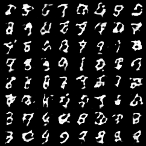
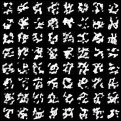
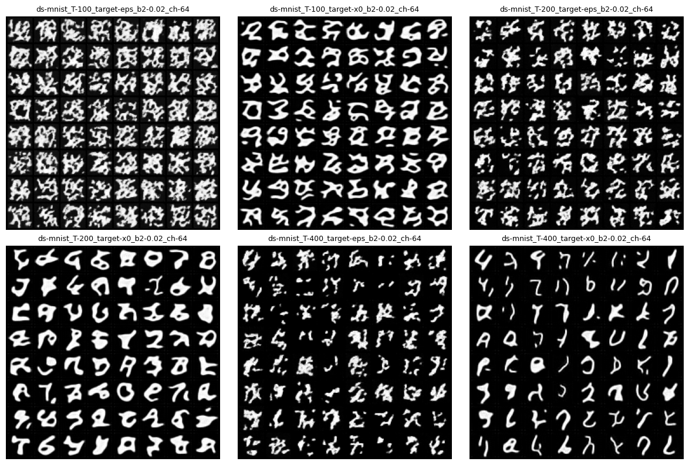

# 1. Introduction

Generative models have recently become an important area of machine learning research, with different model families adopting fundamentally different generation mechanisms. Autoregressive models generate outputs sequentially, while diffusion models generate samples through an iterative denoising process that gradually transforms noise into structured data. Understanding how diffusion model parameters influence the behavior of the generation process is important for both model design and practical use.

This project investigates how key diffusion generation parameters affect the quality and stability of generated images. In particular, we study the effects of two parameters, the number of diffusion steps and the prediction target used during training. The diffusion step count controls how many denoising iterations the model performs, which may influence how well image structure is reconstructed. The prediction target determines whether the model learns to predict the added noise or the original clean image, which may affect sharpness and artifact patterns in generated samples.

Using the MNIST dataset, we run a controlled two-knob experiment that varies diffusion step count and prediction target while keeping other settings fixed. By comparing generated image grids, runtime statistics, and a simple diversity proxy, the project aims to identify how these parameters influence sample quality, artifact patterns, and generation stability.

# 2. Methods

## 2.1 Model families

Two generative model families are used in this project. A DCGAN model is first run as a baseline to demonstrate that the project environment can support end-to-end training and sampling for a generative model. The main experiments are then conducted using a diffusion model, which generates images through an iterative denoising process.

The diffusion model is particularly suitable for controlled experiments because its generation process exposes interpretable parameters such as the number of denoising steps and the training prediction target.

## 2.2 Dataset

All experiments use the MNIST dataset of handwritten digits. MNIST is small and computationally efficient, allowing multiple controlled runs to be executed quickly. Its simple structure also makes visual differences in generated samples easier to analyze.

## 2.3 Controlled experiment design

The core experiment varies two diffusion parameters while keeping all other settings fixed.
- Knob 1: diffusion step count T
- Knob 2: prediction target (ε prediction vs x₀ prediction)

The experiment grid consists of six runs:
- T ∈ {100, 200, 400}
- target ∈ {ε, x₀}

This produces a total of six configurations.

## 2.4 Evaluation signals

Model behavior is evaluated using both qualitative and simple quantitative signals. First, generated sample grids are visually compared to analyze digit sharpness, structural clarity, and artifact patterns. Second, runtime statistics are recorded for each run to examine how diffusion step count affects computational cost. Finally, a simple diversity proxy based on average pairwise pixel-space distance is computed on generated samples to provide a lightweight estimate of sample diversity.

# 3. Results

## 3.1 Baseline results

Before running the controlled experiment, baseline runs were executed for two generative model families. A DCGAN model and a diffusion model were both trained on the MNIST dataset to verify that the project setup can successfully train and generate samples for different generative mechanisms.

The GAN baseline produces recognizable digit shapes with relatively sharp boundaries. However, some samples show uneven stroke thickness or distorted shapes, which are typical GAN artifacts. The diffusion baseline generates digits through an iterative denoising process, but under the current training budget the samples remain noticeably noisy and less clearly defined. This suggests that the diffusion model may require longer training or more denoising steps to reach comparable visual quality.

These baseline results mainly serve as a sanity check and to demonstrate results from two model families, as required by the project. The main focus of the controlled experiments in this study is the behavior of the diffusion model under different generation parameters. Diffusion models provide clear and interpretable generation controls, such as the number of diffusion steps and prediction targets, which makes them suitable for a controlled two-knob study of model behavior.

  
  

**Figure 1.** Baseline samples from two generative model families.  Left: DCGAN baseline. Right: diffusion baseline.

## 3.2 Two-knob experiment results

The main experiment varies two diffusion parameters: the diffusion step count T and the prediction target used during training (ε prediction vs. x₀ prediction). Six configurations were evaluated.

Figure 2 shows generated samples for all six configurations. Rows correspond to diffusion step counts (T = 100, 200, 400), while columns correspond to prediction targets (ε prediction and x₀ prediction).

**Figure 2.** Generated MNIST samples across diffusion parameter settings.

Increasing the diffusion step count slightly improves the overall structure of the generated samples. When the step count is small (T = 100), generated samples often contain strong noise and poorly formed shapes. With larger step counts, the samples become more structured, although many digits remain fragmented and incomplete. Among the tested configurations, T = 400 produces the most coherent digit-like patterns in this experiment.

The prediction target also affects the appearance of generated digits. Models trained with ε prediction tend to produce slightly sharper digit-like patterns. In contrast, x₀ prediction produces smoother but less distinct shapes that sometimes resemble averaged digit blobs rather than clearly written numbers.

## 3.3 Quantitative signals

In addition to visual inspection, runtime statistics and a simple diversity proxy were recorded for each configuration. The diversity proxy measures the average pairwise pixel-space distance between generated samples.

| T   | target | diversity | runtime (s) |
| --- | ------ | --------- | ----------- |
| 100 | ε      | 11.84     | 104.02      |
| 100 | x₀     | 13.15     | 101.28      |
| 200 | ε      | 12.01     | 108.43      |
| 200 | x₀     | 11.91     | 121.52      |
| 400 | ε      | 11.04     | 123.78      |
| 400 | x₀     | 9.77      | 123.65      |

**Table 1.** Runtime and diversity proxy across diffusion configurations.

Runtime increases moderately as the diffusion step count grows. This behavior is expected because larger values of T require more denoising iterations during the generation process.

The diversity proxy shows moderate variation across configurations. The highest diversity score appears at T=100 with x₀ prediction, while the lowest diversity appears at T=400 with x₀ prediction. However, visual inspection suggests that higher diversity scores do not necessarily correspond to better perceptual sample quality. In particular, some high-diversity configurations contain noisy or poorly formed digits. These results indicate that the pixel-space diversity proxy should be interpreted cautiously. While it provides a simple quantitative signal, it does not fully capture perceptual quality or structural correctness of generated digits.

## 4. Failure Modes & Limitations

Several failure modes appear in the generated samples across diffusion configurations.

A common artifact is fragmented digit structure. Many samples consist of disconnected stroke segments rather than continuous handwritten digits. This behavior is evisible across several configurations, particularly when the model is undertrained, where digits often appear as scattered stroke fragments that roughly resemble digit shapes but are not fully coherent numbers.

Another failure mode is noisy or poorly formed shapes at small diffusion step counts. When T = 100, many samples contain heavy background noise and incomplete digit patterns. Increasing the number of diffusion steps reduces some of these artifacts and produces more structured digit-like patterns.

These observations suggest that diffusion models are sensitive to both the number of denoising steps and the prediction objective. With a very small training budget (1 epoch), the model does not fully learn coherent digit structure, leading to fragmented strokes and incomplete shapes during generation.

## 5. Conclusions

This study investigated how diffusion generation parameters influence sample behavior on MNIST. The results show that increasing the diffusion step count slightly improves the overall structure of generated samples, producing somewhat more coherent digit-like patterns compared with smaller step counts. The prediction target also affects visual characteristics, in that ε prediction tends to produce somewhat sharper but more fragmented stroke patterns, while x₀ prediction often produces smoother but blurrier shapes. 

However, many samples remain fragmented or incomplete across configurations, indicating that the model is undertrained with the current one-epoch training budget. This limitation suggests that diffusion models may require longer training or larger compute budgets to fully learn coherent digit structures. Future work could extend this study by increasing training epochs or exploring alternative noise schedules to further examine how training dynamics affect diffusion sample quality.

## Acknowledgments

Portions of this report were drafted with the assistance of OpenAI’s GPT-5, used primarily for phrasing and structural refinement. All coding, data analysis, and interpretations were independently conducted by the author.